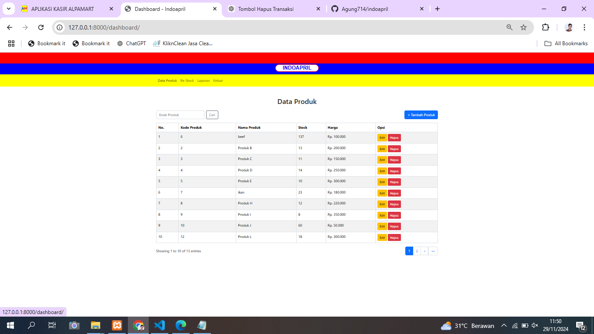
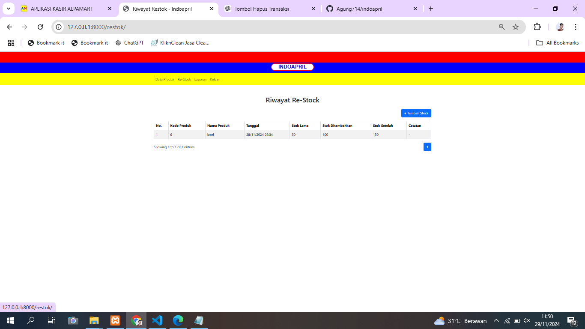
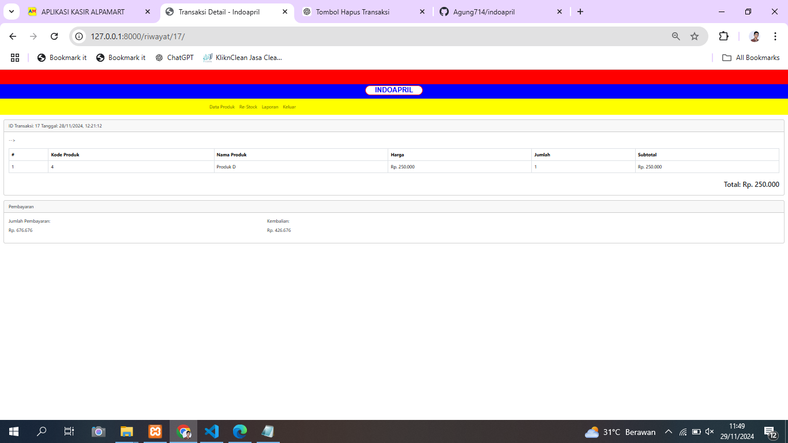
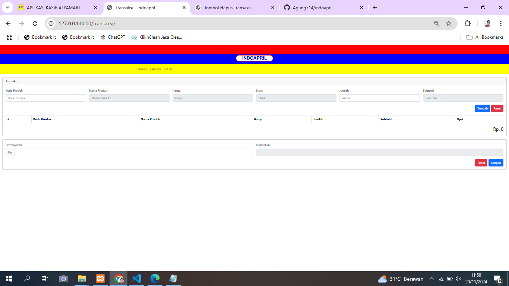

# 

# Indoapril
> Aplikasi kelola inventaris dan kasir.

## 📖 Pembukaan
Selamat datang di repositori Indoapril! Proyek ini bertujuan untuk mempermudah pengelolaan produk dan layanan pelanggan.

Aplikasi ini dirancang untuk pemilik toko yang mengalami kesulitan dalam mengelola pendataan produk yang dijual.

---

## ✨ Fitur Utama
Berikut adalah fitur-fitur utama yang disediakan oleh aplikasi ini:

- **Manajemen Produk:** Tambah, ubah, dan hapus data produk dengan mudah.
- **Riwayat Transaksi:** Tampilkan riwayat lengkap dari transaksi yang dilakukan.
- **Pencarian:** Temukan data produk dengan cepat melalui fitur pencarian yang responsif.
- **Pagination:** Navigasi data dengan lebih rapi menggunakan fitur pagination.
- **Restok:** Menambahkan stok produk.
- **Transaksi:** Mengelola transaksi.
---

## 📋 Dokumentasi

### 1. **Instalasi**
Ikuti langkah-langkah berikut untuk menjalankan proyek ini di mesin lokal Anda:

1. **Clone repositori**
   ```bash
   git clone https://github.com/Agung714/indoapril.git
   ```

2. **Masuk ke direktori proyek**
   ```bash
   cd indoapril
   ```

3. **Jalankan server**
   ```bash
   python manage.py runserver
   ```

4. Buka aplikasi di browser Anda di [http://127.0.0.1:8000](http://127.0.0.1:8000).

---

### 2. **Struktur Proyek**
Berikut adalah struktur direktori utama:

```
.
├── indoapril/               # Folder aplikasi utama
└──static/                 # File statis seperti gambar
├── templates/              # Template HTML untuk antarmuka
├── manage.py               # Skrip manajemen Django
└── README.md               # Dokumentasi proyek ini
```

---

### 3. **Endpoint API**

#### Produk
- **GET /api/produk/**: Mendapatkan daftar produk.
- **GET /api/produk/?search=query**: Mencari produk berdasarkan kata kunci.
- **POST /api/produk/**: Menambahkan produk baru.

---

## 🛠️ Pengembang
Proyek ini dikembangkan oleh:
- **Anandita agung nugraha**  
- **Alianur**  
—


# Login
Page untuk melakukan login

# Dashboard (Manajer)
Page kelola produk

# Search (Manajer)
Untuk mencari produk di page Dashboard

# Form Create (Manajer)
Form untuk menambahkan produk

# Form Edit (Manajer)
Form untuk mengubah data produk

# Restok (Manajer)
Riwayat Restok

# Form Restok (Manajer)
Form untuk menambahkan stok produk

# Riwayat (Manajer)
Riwayat Transaksi

# Detail (Manajer)
Page Detail Transaksi

# Transaksi (Kasir)
Page Kasir melakukan transaksi



